# ARX Architecture

This document is a complete architectural reference for the ARX codebase, covering both High-Level Design (HLD) and Low-Level Design (LLD) with Mermaid diagrams.

---

## Overview

ARX is a modern, portable archive format that sits between traditional archives (zip, tar.gz) and cloud object storage. It stores files as content-defined chunks, compressed with Zstandard, and optionally encrypted per-region with XChaCha20-Poly1305 — all inside a single binary file.

Three design principles run through the entire codebase:

1. **Immutable base, append-only overlay.** The `.arx` archive is never rewritten after creation. Mutations are accumulated in sidecar files (`.arx.log` journal + `.arx.delta` data store) and optionally compacted back to a fresh base via `sync`.
2. **Region-scoped encryption.** The manifest, chunk table, and each data chunk are each sealed independently with a deterministically derived nonce. There is no master encrypted envelope; regions can be decrypted in isolation.
3. **Content-defined chunking for deduplication.** Files are split at content-defined boundaries (FastCDC / Gear rolling hash) rather than fixed block sizes, so identical sub-file regions deduplicate across files regardless of byte offsets.

---

## High-Level Design

### HLD 1 — System Context

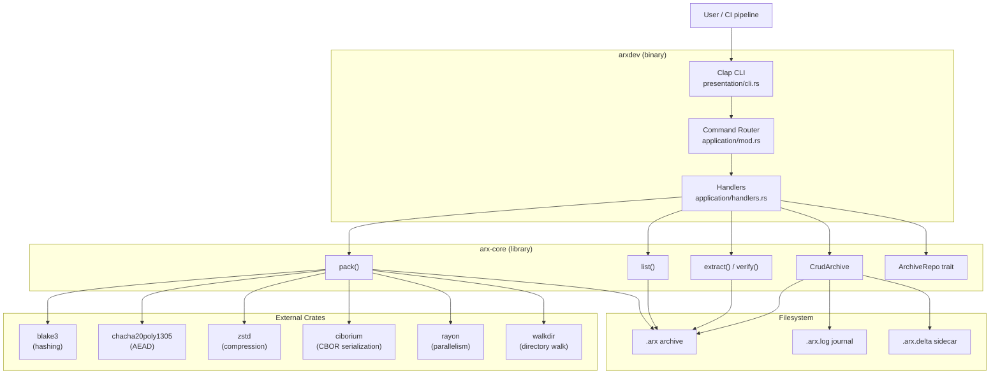

---

### HLD 2 — Workspace & Crate Layers

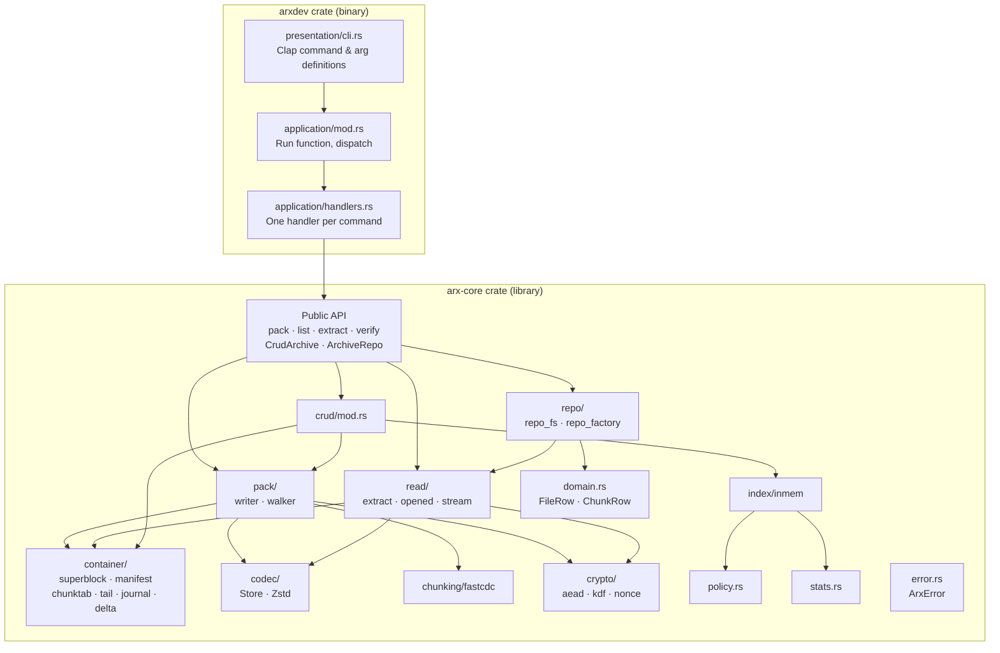

---

### HLD 3 — On-Disk Archive Binary Layout

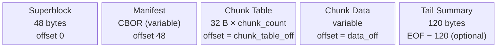

**Superblock fields (48 bytes, all little-endian):**

| Bytes | Field | Value / Notes |
|-------|-------|---------------|
| 0–5 | magic | `ARXALP` (alpha marker) |
| 6–7 | version | `u16` = 3 |
| 8–15 | manifest_len | byte length of manifest region |
| 16–23 | chunk_table_off | file offset of chunk table |
| 24–31 | chunk_count | number of chunks |
| 32–39 | data_off | file offset where chunk data starts |
| 40–47 | flags | bit 0 = `FLAG_ENCRYPTED` (0x1) |

**Chunk Table entry (32 bytes per entry):**

| Bytes | Field | Notes |
|-------|-------|-------|
| 0 | codec | 0 = Store, 1 = Zstd |
| 1–7 | padding | reserved |
| 8–15 | u_size | uncompressed size |
| 16–23 | c_size | compressed size (includes 16-byte AEAD tag if encrypted) |
| 24–31 | data_off | absolute file offset to this chunk's bytes |

**Tail Summary (120 bytes):**

| Bytes | Field | Notes |
|-------|-------|-------|
| 0–7 | magic | `ARXTAIL\0` |
| 8–39 | manifest_blake3 | BLAKE3 hash of plaintext manifest |
| 40–71 | chunktab_blake3 | BLAKE3 hash of plaintext chunk table |
| 72–103 | data_blake3 | BLAKE3 hash of all plaintext chunk data |
| 104–111 | total_u | total uncompressed bytes |
| 112–119 | total_c | total compressed bytes |

---

### HLD 4 — Module Dependency Map

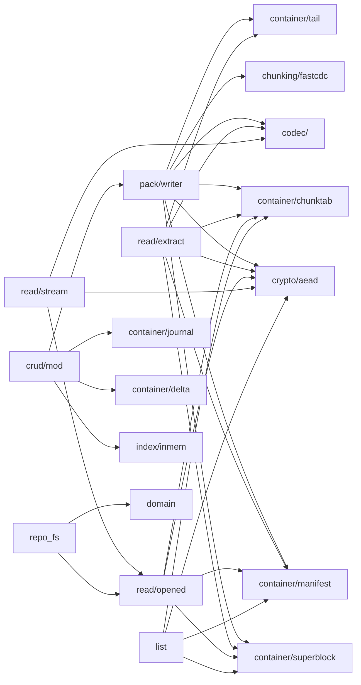

---

### HLD 5 — Pack Data Flow (Create Archive)

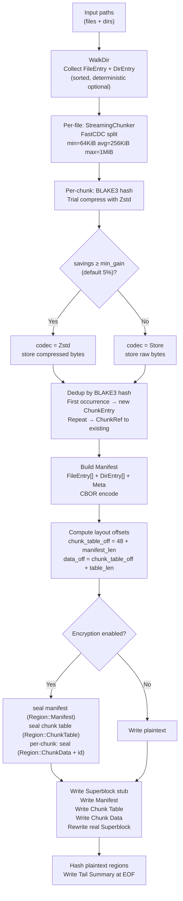

---

### HLD 6 — Extract Data Flow

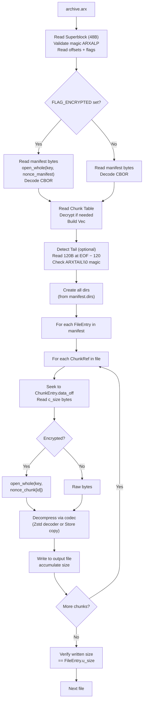

---

### HLD 7 — CRUD Overlay Architecture

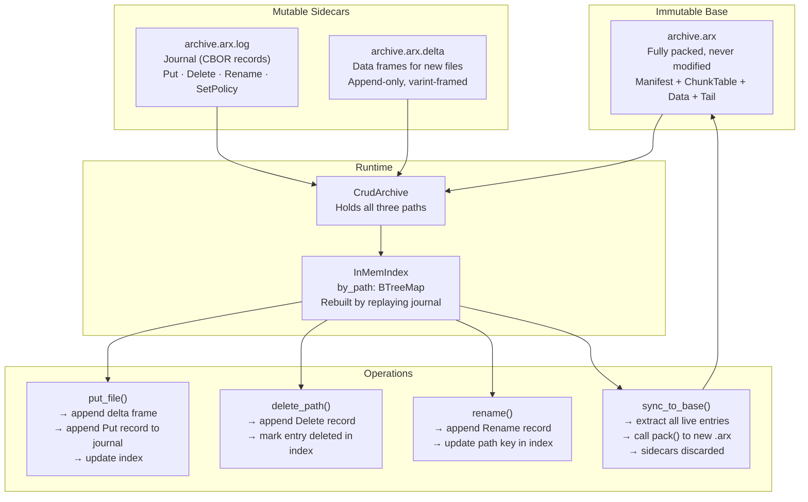

---

### HLD 8 — CLI Command Map

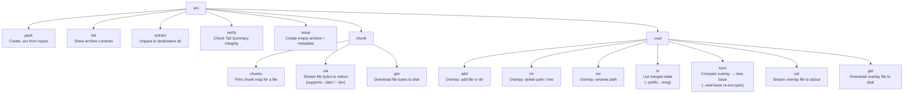

---

## Low-Level Design

### LLD 1 — Superblock

`arx-core/src/container/superblock.rs`

```mermaid
classDiagram
    class Superblock {
        +version: u16
        +manifest_len: u64
        +chunk_table_off: u64
        +chunk_count: u64
        +data_off: u64
        +flags: u64
        +write_to(w: impl Write) Result~()~
        +read_from(r: impl Read) Result~Superblock~
    }
    note for Superblock "MAGIC = b\"ARXALP\" (6 bytes)\nVERSION = 3\nHEADER_LEN = 48\nFLAG_ENCRYPTED = 1 << 0"
```

**On-disk bytes (little-endian):**
```
offset  0: [6B] "ARXALP"
offset  6: [2B] version   (u16)
offset  8: [8B] manifest_len
offset 16: [8B] chunk_table_off
offset 24: [8B] chunk_count
offset 32: [8B] data_off
offset 40: [8B] flags
```

---

### LLD 2 — Manifest, ChunkTable & TailSummary Structs

`arx-core/src/container/manifest.rs`, `chunktab.rs`, `tail.rs`

```mermaid
classDiagram
    class Manifest {
        +files: Vec~FileEntry~
        +dirs: Vec~DirEntry~
        +meta: Meta
    }
    class FileEntry {
        +path: String
        +mode: u32
        +mtime: i64
        +u_size: u64
        +chunk_refs: Vec~ChunkRef~
    }
    class ChunkRef {
        +id: u64
        +u_size: u64
    }
    class DirEntry {
        +path: String
        +mode: u32
        +mtime: i64
    }
    class Meta {
        +created: i64
        +tool: String
    }
    class ChunkEntry {
        +codec: u8
        +u_size: u64
        +c_size: u64
        +data_off: u64
    }
    note for ChunkEntry "ENTRY_SIZE = 32 bytes\ncodec: 0=Store 1=Zstd\nc_size includes 16B AEAD tag if encrypted"
    class TailSummary {
        +manifest_blake3: [u8; 32]
        +chunktab_blake3: [u8; 32]
        +data_blake3: [u8; 32]
        +total_u: u64
        +total_c: u64
        +write_to(w: impl Write) Result~()~
        +read_from(r: impl Read) Result~TailSummary~
        +read_tail_at_eof(f: impl Read+Seek) Result~TailSummary~
    }
    note for TailSummary "TAIL_MAGIC = b\"ARXTAIL\\0\"\nTAIL_LEN = 120 bytes"

    Manifest "1" --> "*" FileEntry
    Manifest "1" --> "*" DirEntry
    Manifest "1" --> "1" Meta
    FileEntry "1" --> "*" ChunkRef
```

> `ChunkRef.id` is an index into the flat `Vec<ChunkEntry>` (the chunk table). Multiple `FileEntry` items may share the same `id` (deduplication).

---

### LLD 3 — Encryption Scheme

`arx-core/src/crypto/aead.rs`

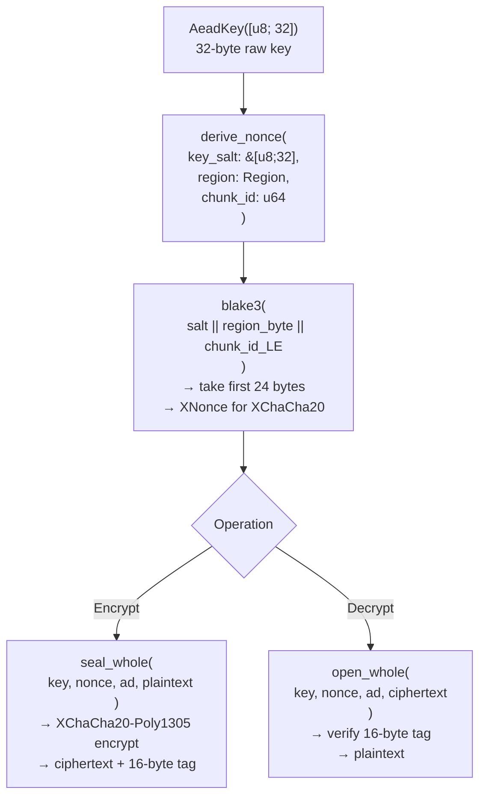

**Region constants (domain separation):**

| Region | Value | Scope | Nonce chunk_id |
|--------|-------|-------|----------------|
| `Manifest` | 1 | Entire manifest CBOR | 0 |
| `ChunkTable` | 2 | Entire chunk table | 0 |
| `ChunkData` | 3 | Per individual chunk | chunk index |

**Associated data (ad) passed to AEAD:**
- Manifest: `b"manifest"`
- ChunkTable: `b"chunktab"`
- ChunkData: `b"chunk"`

**Size impact:** Every encrypted region grows by `TAG_LEN = 16` bytes.

---

### LLD 4 — FastCDC Content-Defined Chunking

`arx-core/src/chunking/fastcdc.rs`

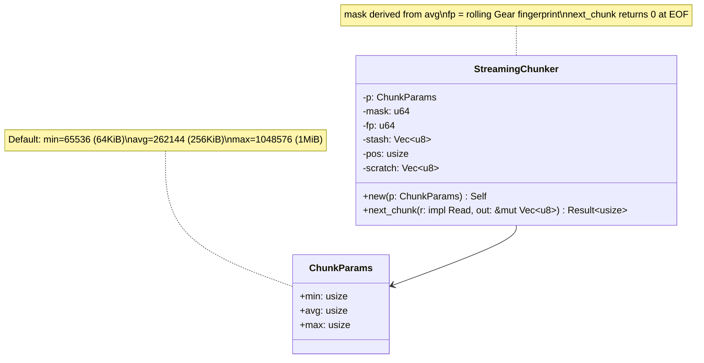

**Boundary detection algorithm (inside `next_chunk`):**

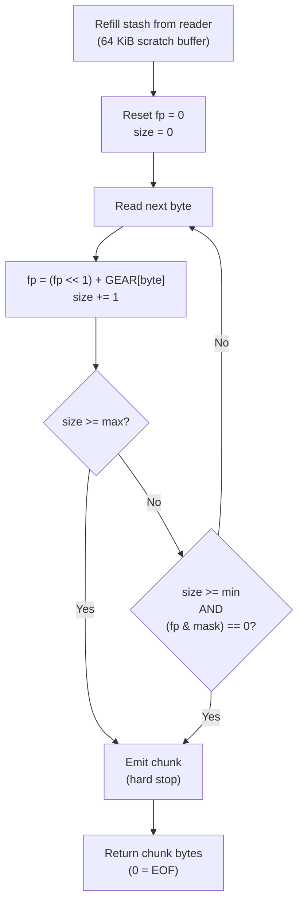

The `GEAR` table is 256 × `u64` pseudo-random values built with SplitMix64, seeded deterministically. The `mask` is `(1 << bits) - 1` where `bits = ceil(log2(avg))`, giving a 1-in-avg probability of a boundary per byte.

---

### LLD 5 — Codec System

`arx-core/src/codec/`

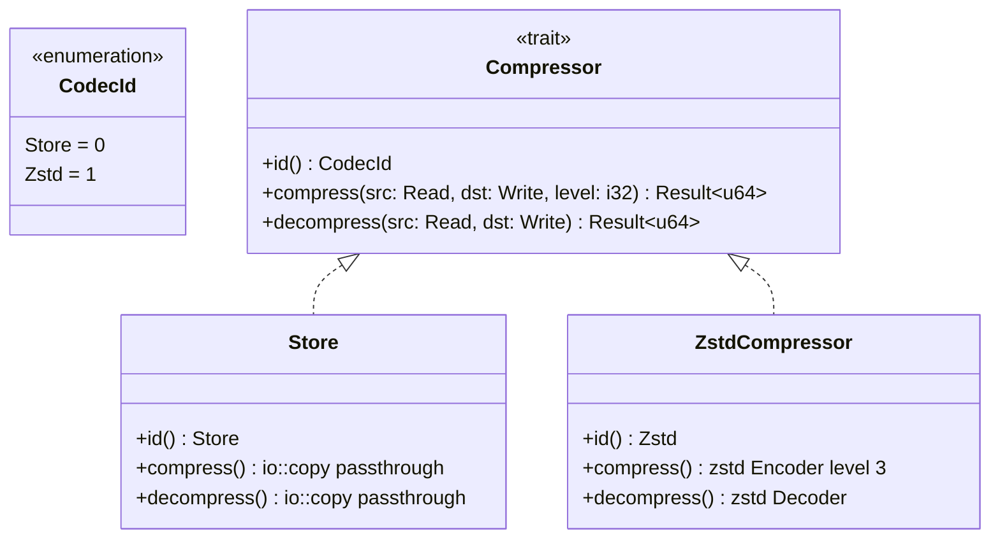

**Factory function:**
```rust
// arx-core/src/codec/mod.rs
pub fn get_decoder_u8(codec: u8) -> Result<&'static dyn Compressor>
// Returns &Store (0) or &ZstdCompressor (1); errors on unknown codec
```

**Codec selection during pack:**
```
should_compress = (u_size - c_size) as f32 >= u_size as f32 * min_gain
```
where `min_gain` defaults to `0.05` (5% savings required).

---

### LLD 6 — Journal & Delta (CRUD On-Disk Format)

`arx-core/src/container/journal.rs`, `delta.rs`

```mermaid
classDiagram
    class EncMode {
        <<enumeration>>
        Plain
        Aead { key: [u8;32], salt: [u8;32] }
    }

    class Loc {
        <<enumeration>>
        Base
        Delta
    }

    class ChunkRef {
        +loc: Loc
        +off: u64
        +len: u64
        +codec: CodecId
        +blake3: [u8; 32]
    }

    class LogRecord {
        <<enumeration>>
        Put { path, mode, mtime, size, chunks: Vec~ChunkRef~ }
        Delete { path }
        Rename { from, to }
        SetPolicy(Policy)
        Note { text }
    }

    class Journal {
        -f: File
        -path: PathBuf
        -enc: EncMode
        -flags: u8
        -salt: [u8; 32]
        +open(path, enc) Result~Journal~
        +append(rec: LogRecord) Result~()~
        +iter() Result~JournalIter~
    }
    note for Journal "MAGIC = b\"ARXLOG\\0\\0\"\nVERSION = 1\nFLAG_AEAD = 0x01\nHeader = 41 bytes\nRecords: varint(len) + CBOR"

    class DeltaStore {
        -f: File
        -path: PathBuf
        -next_off: u64
        -enc: EncMode
        -salt: [u8; 32]
        +open(path, enc) Result~DeltaStore~
        +append_frame(plain: &[u8]) Result~(u64, u64)~
        +read_frame(off, len) Result~Box~dyn Read~~
    }
    note for DeltaStore "Returns (offset, length)\nFrames: varint(len) + bytes\nOptional AEAD per-frame"

    Journal --> LogRecord
    LogRecord --> ChunkRef
    ChunkRef --> Loc
    Journal --> EncMode
    DeltaStore --> EncMode
```

**Nonce derivation for sidecars:**

| Sidecar | Domain string | Extra input |
|---------|--------------|-------------|
| Journal record | `b"arxlog"` | `payload_off \|\| cipher_len` |
| Delta frame | `b"arxdelta"` | `payload_off \|\| cipher_len` |

Both derive 24-byte XChaCha20 nonces via `blake3(domain || salt || extra).take(24)`.

---

### LLD 7 — InMemIndex & CRUD State Machine

`arx-core/src/index/inmem.rs`, `arx-core/src/crud/mod.rs`

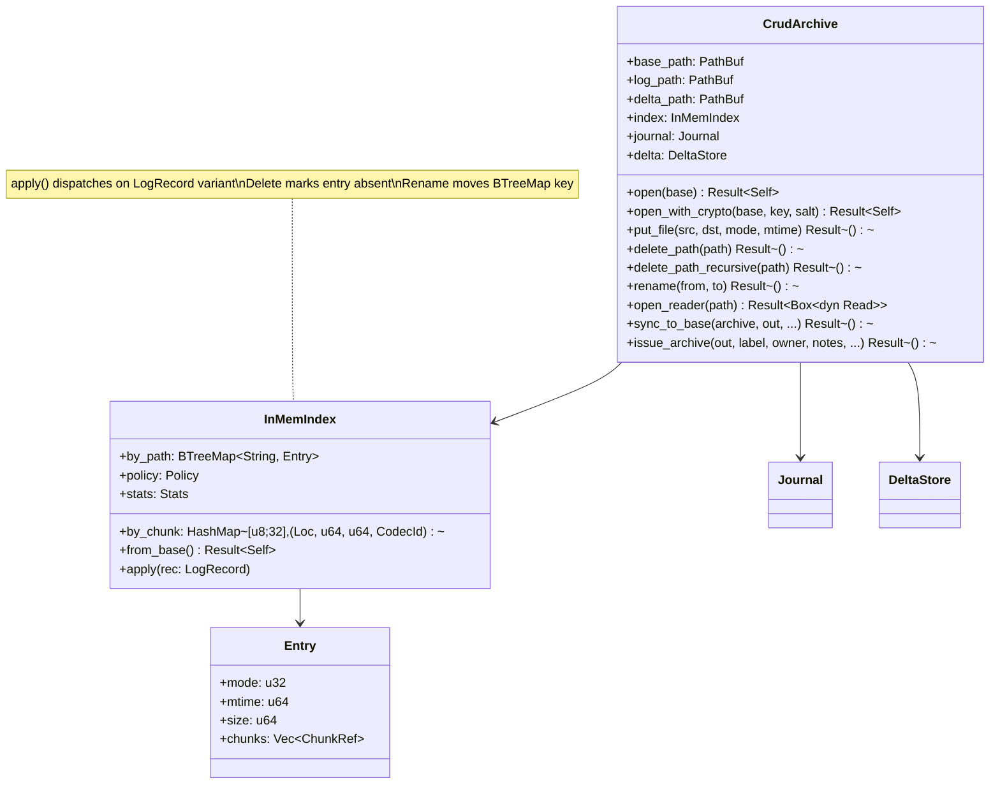

**State machine: opening a CrudArchive**

```mermaid
stateDiagram-v2
    [*] --> OpenFiles: open(base_path)
    OpenFiles --> ReadJournal: open journal sidecar\n(.arx.log)
    ReadJournal --> OpenDelta: open delta sidecar\n(.arx.delta)
    OpenDelta --> ReplayJournal: iterate LogRecords
    ReplayJournal --> ApplyPut: LogRecord::Put
    ReplayJournal --> ApplyDelete: LogRecord::Delete
    ReplayJournal --> ApplyRename: LogRecord::Rename
    ReplayJournal --> ApplyPolicy: LogRecord::SetPolicy
    ApplyPut --> ReplayJournal: upsert by_path + by_chunk
    ApplyDelete --> ReplayJournal: remove by_path entry
    ApplyRename --> ReplayJournal: move BTreeMap key
    ApplyPolicy --> ReplayJournal: update policy
    ReplayJournal --> Ready: EOF on journal
    Ready --> [*]
```

---

### LLD 8 — ArchiveRepo Trait & Reading Pipeline

`arx-core/src/repo.rs`, `repo_fs.rs`, `read/opened.rs`, `read/stream.rs`

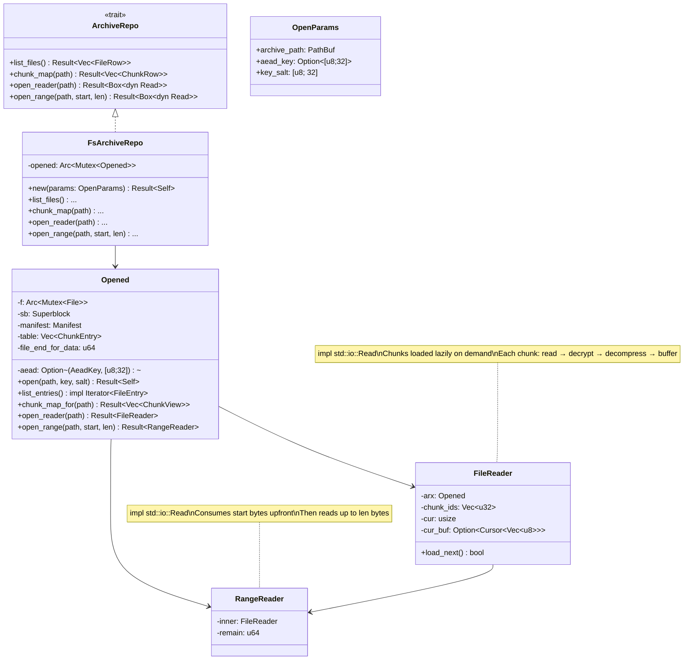

**open_repo factory:**
```rust
// arx-core/src/repo_factory.rs
pub enum Backend { Fs }
pub fn open_repo(backend: Backend, p: OpenParams) -> Result<Box<dyn ArchiveRepo>>
```

---

### LLD 9 — Error Types

`arx-core/src/error.rs`

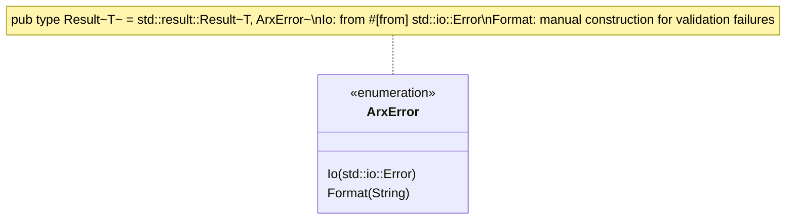

**Where each variant surfaces:**

| Variant | Common causes |
|---------|---------------|
| `Io` | File not found, permission denied, unexpected EOF, disk full |
| `Format` | Bad CBOR, wrong magic bytes, tag mismatch (AEAD auth failure), path traversal attempt (`../`), mismatched sizes, unknown codec id, tail hash mismatch |

All public API functions return `Result<T>`. `arxdev` handlers propagate errors to the CLI top-level, which prints the error and exits non-zero.

---

## Key Constants Summary

| Constant | Value | Source |
|----------|-------|--------|
| `MAGIC` | `b"ARXALP"` | `container/superblock.rs` |
| `VERSION` | `3` | `container/superblock.rs` |
| `HEADER_LEN` | `48` bytes | `container/superblock.rs` |
| `FLAG_ENCRYPTED` | `1 << 0` | `container/superblock.rs` |
| `ENTRY_SIZE` | `32` bytes | `container/chunktab.rs` |
| `TAIL_MAGIC` | `b"ARXTAIL\0"` | `container/tail.rs` |
| `TAIL_LEN` | `120` bytes | `container/tail.rs` |
| `TAG_LEN` | `16` bytes | `crypto/aead.rs` |
| `JOURNAL_MAGIC` | `b"ARXLOG\0\0"` | `container/journal.rs` |
| `JOURNAL_VERSION` | `1` | `container/journal.rs` |
| `CDC min` | `65536` (64 KiB) | `chunking/fastcdc.rs` |
| `CDC avg` | `262144` (256 KiB) | `chunking/fastcdc.rs` |
| `CDC max` | `1048576` (1 MiB) | `chunking/fastcdc.rs` |
| `default min_gain` | `0.05` (5%) | `pack/writer.rs` |
| `Zstd level` | `3` | `codec/zstdc.rs` |
